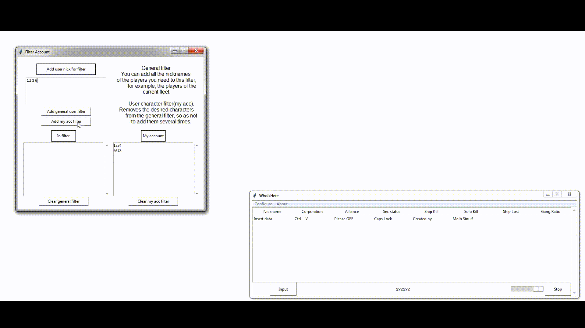

# WhoIsHere
## About
The program was created for the game Eve Online.
**The main task** is to check for possible danger of players who are in the same system with you.

## How to use:
Copy the necessary nicknames from the game Eve online, open the program window and press **ctrl + v**.
Attention.
If the key combination **ctrl + v** does not work for you, you can use the **Input** button to insert nicknames.
If suddenly you have copied too many nicknames and do not want to wait for the program to process, you can press the **Stop** button.

### Filters
Filters can be added to the program. Filters will speed up the receipt of information about opponents and the operation of the program when flying in a fleet.
You can create 2 filters:
1. General filter of players. You can add all the nicknames of the players you need to this filter, for example, the players of the current fleet.
2. User character filter. Removes the desired characters from the general filter, so as not to add them several times.

### Additional functions:
1. Always on top - allows the program to always be on top of other windows.
2. Background key intercaption - launches the keystroke reader, thanks to it: by selecting characters in the local chat and pressing the ctrl + c key combination, the program will automatically receive the characters' nicknames and give you the information you need.
3. Slider - changes the transparency of the program
4. If you click on the character's nickname in the program for 2 seconds or more, you can copy the link to the character's personal page on the site zkillboard.com

### Respect for my work
If you are an eve online player and want to thank me for my work. You can transfer my claims to the game nickname Eve Online - Molb Sinulf

### Last version
[V1_2](Builds/v1_2)
